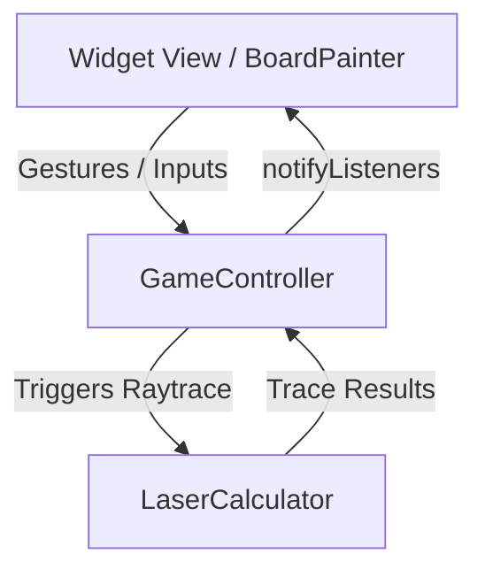

# Flutter & Game Development Coding Guide

This guide establishes the coding standards, patterns, and best practices for developing high-performance, responsive Flutter applications, specifically optimized for **custom-painted mobile games** like *Star Destroyer: Single Shot*.

---

## 1. Game State Management & Controller Pattern

To build maintaining, scalable game logic, separate state, logic, and rendering layers into dedicated components:

*   **Logic (Calculator/Simulation)**: Static, pure calculation engines (e.g., `LaserCalculator`). They must be completely stateless, taking in parameters and returning deterministic results. This ensures that calculations can be run inside background isolates, tests, or pre-render simulations without side effects.
*   **State (Controller)**: Central controllers extending `ChangeNotifier` (e.g., `GameController`). The controller manages the game loop timers, level progressions, active placements, and selected tools, notifying listeners when state updates occur.
*   **Visuals (View/Painter)**: Painters and widget screens that consume states and render them. They do not contain game logic; they only paint what the controller describes.



---

## 2. Canvas Painting & Render Performance

Games drawn using Flutter's `CustomPainter` require careful performance tuning to maintain $60$ FPS (or $120$ FPS on modern displays).

### 2.1 Repaint Boundaries
Heavy canvas drawings should be isolated from the rest of the widget tree. Wrap your `CustomPaint` widget inside a `RepaintBoundary`:
```dart
RepaintBoundary(
  child: CustomPaint(
    painter: BoardPainter(...),
  ),
)
```
> [!NOTE]
> A `RepaintBoundary` creates a separate display list for the child, preventing surrounding widget rebuilds (e.g., header text timers or statistics panels) from forcing a repaint of the intensive game board.

### 2.2 Optimizing `shouldRepaint`
Never blindly return `true` inside your custom painter's `shouldRepaint` method. Check every mutable dependency explicitly:
```dart
@override
bool shouldRepaint(covariant BoardPainter oldDelegate) {
  return oldDelegate.level != level ||
      oldDelegate.aimingAngle != aimingAngle ||
      oldDelegate.playState != playState ||
      oldDelegate.animationProgress != animationProgress;
}
```

### 2.3 Pre-calculating Constants
Avoid allocation and calculation of paths or mathematical constants inside the `paint` loop.
*   Use local helper methods for scaling, but define structural constants (like standard HSL colors or `pi` divisions) outside the loop.
*   Do not instantiate heavy `Paint` objects repeatedly. Instantiate them once at the top of the `paint` method or cache them.

---

## 3. Portrait Responsive Coordinates Grid

Mobile-first games must support varying screen heights and aspect ratios (e.g., $16:9$, $19.5:9$, $4:3$ tablets).

### 3.1 Aspect Ratio Lock
Rather than adjusting calculations to arbitrary pixel dimensions, lock the drawing canvas to a fixed coordinate system (e.g., `8x12` grid coordinates) and wrap the board inside an `AspectRatio`:
```dart
AspectRatio(
  aspectRatio: 8 / 12,
  child: LayoutBuilder(
    builder: (context, constraints) {
      final cellW = constraints.maxWidth / 8.0;
      final cellH = constraints.maxHeight / 12.0;
      // Now translate grid coordinates (gx, gy) to pixels:
      // Offset(gx * cellW, gy * cellH)
    },
  ),
)
```

### 3.2 Safe Areas & Bottom Decks
Always place bottom firing decks or console panels inside a `SafeArea` with `top: false`. Maintain safe margins for floating overlays (like the Toolbox FAB or Inventory sliding drawers) so they do not overlap system indicators or camera notches.

---

## 4. Mathematics & Physics in State Loop

### 4.1 Step-Based Raytracing & Physics
When tracing lasers or moving physics bodies:
*   Avoid large delta steps which can pass straight through thin wall colliders.
*   Use small, high-resolution calculation steps (e.g., `stepSize = 0.05` cells) inside a boundary-safe loop.
*   Enforce a maximum step limit (e.g., `maxSteps = 400`) to guarantee that laser loops or infinite gravity well bends terminate safely and do not lock the UI main thread.

### 4.2 Angle & Firing Clamp
Angles in Flutter's Cartesian coordinate space start with $0^\circ$ pointing straight right, $-90^\circ$ pointing straight up, and $-180^\circ$ pointing straight left. Firing bounds must be clamped strictly to the active shooting semicircle to prevent offscreen tracing or logical errors.
```dart
aimingAngle = targetAngle.clamp(-180.0, 0.0);
```

---

## 5. Touch Gestures & Ergonomics

*   **Remove Sliders**: Direct gesture steering on the play field is significantly more immersive than mechanical sliders.
*   **Pan Update Delta**: Use horizontal swiping `onPanUpdate` to steer the aiming angle. Adjusting sensitivity (e.g., `delta.dx * 0.35`) gives players highly precise micro-targeting capability.
*   **Haptic Feedback**: Implement micro-vibrations (`HapticFeedback.lightImpact()` or `selectionClick()`) when rotating mirrors, locking items, or firing, providing satisfying tactile reinforcement.

---

## 6. Premium Cyberpunk Aesthetic Rules

To deliver an elite, visually stunning first impression, follow these design axioms:

| Aspect | Customization Rule |
| :--- | :--- |
| **Colors** | Avoid standard solid hex values. Leverage neon-themed palettes (e.g., Glowing Cyan `0xFF00FFF5`, Cyber Pink `0xFFFF2E93`, Tech Amber `0xFFFFB703`). |
| **Atmospheric Glows** | Paint layered circles under planets and devices using a high blur radius, simulating space atmospheres: `MaskFilter.blur(BlurStyle.normal, scale * 0.1)`. |
| **Glassmorphism** | Sliding drawer panels must use translucent black fills (`withOpacity(0.85)`) coupled with blurred overlays and bright neon borders. |
| **Typography** | Always enforce monospaced custom fonts for digital console stats (like active degrees `"-90°"`) to prevent text shifting during layout changes. |
