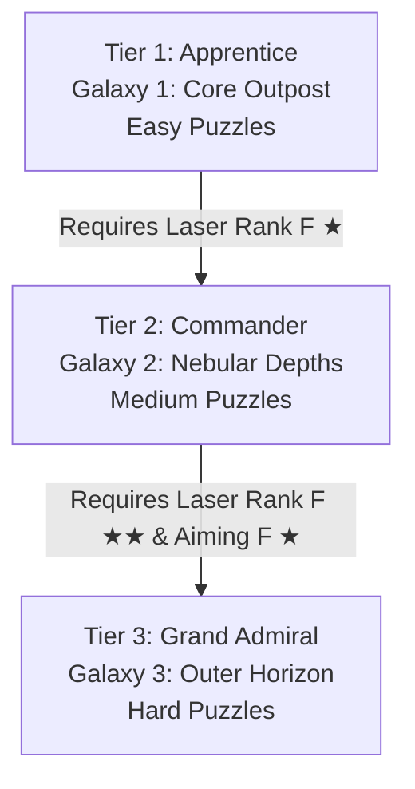

# Star Destroyer: Single Shot — Game Design & Solvability Guide

This guide establishes the rules of engagement, game mechanics, component parameters, and design guidelines for **Star Destroyer: Single Shot**. 

> [!IMPORTANT]
> **MANDATORY RULE FOR LEVEL DESIGNERS**:
> When adding a new Sector (Level) to the database, you **MUST** ensure and verify that the level is mathematically and logically solvable using the provided inventory blueprints and constraints. Obstructing a required placement coordinate with a static wall or planet is strictly prohibited.

---

## 1. Core Objective

The objective of each sector is to **destroy all target planets** in a single consolidated firing sequence. 
*   **Shielded Planets**: Many planets are heavily shielded and cannot be destroyed by direct laser contact.
*   **Volatile Bombs**: Volatile bomb cores are highly reactive. Hitting a bomb core with the superlaser triggers a massive chain reaction shockwave with an explosion radius of **2.2 cells**, vaporizing all planets and structures within that area.

---

## 2. Sector Dimensions & Coordinates System

Sectors are built on a native vertical portrait coordinates grid:
*   **Dimensions**: 8 columns wide ($X \in [0, 7]$) by 12 rows high ($Y \in [0, 11]$).
*   **Coordinates**: Grid origins start at the top-left $(0, 0)$.
*   **Death Star Placement**: Centered at the bottom row ($Y=11$, usually $X=3$ or $X=2$).
*   **Firing Arc Constraints**: Firing trajectory is strictly bounded to the upward semicircle ($[-180.0^\circ, 0.0^\circ]$). Firing angles outside this arc (e.g. downward) are automatically clamped.

---

## 3. Inventory Blueprint Components

Players are equipped with high-tech tactical modules to steer and manipulate the laser:

### 3.1 Reflector (Glass Mirror)
*   **Function**: Intercepts the laser beam and reflects it based on standard vector reflection geometry ($R = I - 2(I \cdot N)N$).
*   **Rotation**: Rotates in $45^\circ$ increments.
*   **Design Use**: Bends the straight-up laser around asteroid walls.

### 3.2 Splitter (Prism Crystals)
*   **Function**: Splits a single incoming laser beam into two distinct beams.
*   **Outputs**: 
    1.  *Vector 1* continues along the splitter's primary rotation angle.
    2.  *Vector 2* emerges at a variant separation offset angle ($45^\circ$, $90^\circ$, $135^\circ$, or $180^\circ$).
*   **Design Use**: Essential for sectors containing multiple planets in separated orbits.

### 3.3 Gravity Well (Swirling Core)
*   **Function**: Exerts a continuous pulling force on the laser beam, curving its trajectory.
*   **Pull Radius**: Pulls within a range of $3.5$ cells. 
*   **Design Use**: Used to create curved gravity slingshots to reach targets hidden behind asteroid screens.

### 3.4 Portals (Einstein-Rosen Pairs)
*   **Function**: Instantly teleports a laser beam entering Portal A out of Portal B, maintaining the beam's original travel angle.
*   **Design Use**: Used to traverse large asteroid obstacles or cross extreme distances instantly.

---

## 4. Mandatory Level Design Solvability Protocol

To prevent unsolvable states (such as the Level 4 coordinate conflict where a wall blocked the only valid reflection cell), every level creator **must** adhere to this checklist before committing a sector to `lib/models/level_data.dart`:

### 4.1 Slot Emptiness Verification
Ensure that the exact coordinates $(x, y)$ planned for critical player reflector/splitter placements are **completely empty**:
*   No static asteroid `WallBlock` can occupy the coordinates.
*   No preset `PlanetTarget` or locked `presetDevices` can occupy the coordinates.
*   The path of the laser leading *to* the required reflection/split point must not be blocked by preloaded walls.

### 4.2 Mathematical Solution Verification
Calculate the laser path mathematically to ensure a clear solution path exists:
$$\text{Trajectory Path} \cap \text{Target Cells} \neq \emptyset$$
*   If a bomb core is used, check that all target planets fall within the Euclidean distance of $2.2$ cells from the bomb's center $(x_b + 0.5, y_b + 0.5)$:
$$\sqrt{(x_p - x_b)^2 + (y_p - y_b)^2} < 2.2$$

### 4.3 Simulation Testing
*   Deploy the sector locally and run the solution sequence in the simulator to verify that the victory screen triggers and all listeners notify successfully.

---

## 5. Campaign Progression & Balanced Game Difficulty Scale

To provide a highly satisfying, engaging, and balanced progression loop, the game's campaign sectors, training levels, and chassis/device capabilities are divided into three distinct difficulty tiers. This ensures that the learning curve increases smoothly from simple tutorials up to complex spatial puzzle networks.

### 5.1 Difficulty Tier Classification & Balance

#### Tier 1: Apprentice Sectors (Galaxy 1 — Core Outpost)
*   **Difficulty Rating**: Easy (Sectors 1-3)
*   **Core Concepts**: Basic vector reflection and straight-line S-bend pathing.
*   **Obstacles**: Volcanic Obsidian Asteroids (indestructible blocks that partition coordinate bounds).
*   **Requirements**: 
    - None (Open to all recruits by default).
    - Sub-systems start at **Rank F** (Level 1).
*   **Available Inventory**: Standard Deflector Reflectors only.
*   **Economy Yields**: Medium Credits (C) for initial upgrades. No dynamic Research Points (RP).

#### Tier 2: Commander Sectors (Galaxy 2 — Nebular Depths)
*   **Difficulty Rating**: Medium / Intermediate (Sectors 4-5, Training Programs 1-6)
*   **Core Concepts**: Multi-target beam bifurcation, volatile chain explosions, and laser intensity attenuation management.
*   **Obstacles**: Penetrable obstacles spawning dynamically from the second galaxy onwards:
    - **Energy Shields**: Cyan barriers requiring Laser Power $\ge 2$. Transits into a semi-transparent deactivated pulse state on penetration.
    - **Crystals**: Pink barriers requiring Laser Power $\ge 3$.
    - **Scrap Metal**: Orange barriers requiring Laser Power $\ge 2$.
    - **Space Debris**: Free-floating low-poly borderless clutters that occlude coordinate cells.
*   **Unlock Requirements**:
    - Clearance of Galaxy 1.
    - **Laser Intensity Rank F ★+** (Star Rating $\ge 1$, Cumulative Score $\ge 1$).
*   **Available Inventory**: Reflectors, Splitters, and Deployable Volatile Bombs.
*   **Level-Dependent Balance Mechanics**:
    - *Prism Splitters*: Unstable Level 1 splitters drain exactly 1 laser power from both split output beams. Upgrading to Level 2+ stabilizes the prisms, enabling 100% efficient, lossless splitting.
    - *Volatile Bombs*: A Level $L$ bomb can only destroy planets with a defense shield rating $\le L$. Highly shielded planets survive nearby low-level blasts, urging players to prioritize bomb level upgrades.

#### Tier 3: Grand Admiral Sectors (Galaxy 3 — Outer Horizon & Advanced Training)
*   **Difficulty Rating**: Hard / Master (Sector 6, Training Programs 7-15)
*   **Core Concepts**: Multi-dimensional Einstein-Rosen wormhole transits, curved gravitational slingshot orbits, and complex bifurcated layouts.
*   **Obstacles**: Shielded Planets (Level 2+ target planets requiring high laser intensity/bombs) and elaborate obsidian labyrinths.
*   **Unlock Requirements**:
    - Clearance of Galaxy 2.
    - **Laser Intensity Rank F ★★+** (Star Rating $\ge 2$).
    - **Aiming Computer Rank F ★+** (Star Rating $\ge 1$).
    - Researched Portal Blueprints.
*   **Available Inventory**: Full tactical inventory (Portals, Gravity Wells, Splitters, Bombs, Reflectors).
*   **Level-Dependent Balance Mechanics**:
    - *Einstein-Rosen Portals*: Unstable Level 1 portals drain 1 laser power during wormhole transit. Upgrading to Level 2+ stabilizes the warp gate for lossless transit.
    - *Gravity Wells*: Upgrading increases gravitational active attraction radius ($Radius = 2.5 + 0.3 \times Level$) and pull strength ($0.10 + 0.03 \times Level$), enabling sharp vector curves.

#### 5.1.1 Daily Hard Softlock Protection Rule
When the global **Daily Hard** threat modifier is active, standard sectors in advanced galaxies undergo structural threat hardening, adding defensive shields to targets and placing extra obsidian obstructions.
*   **The Risk**: New recruits begin their career with exactly $0$ Credits, $0$ RP, and standard Level 1 lasers. If their introductory levels were subject to Daily Hard boosts, they would face shielded planets requiring Level 2+ lasers. Because they cannot destroy any planets, they would be unable to earn credits to buy upgrades, resulting in an immediate soft-lock.
*   **The Rule**: **Galaxy 1 (Core Outpost) campaign levels are strictly immune to all Daily Hard difficulty boosts and shield adjustments.** Under no circumstances can a modifier increase target shields or block paths in Galaxy 1. This guarantees that starting levels remain 100% solvable with base equipment, allowing new players to safely complete them and earn their initial credits.

#### 5.1.2 Procedural Generation Direct-Hit Restriction (Galaxy 2+)
To preserve challenge, spatial complexity, and target puzzle depth across procedurally generated maps:
*   **The Goal**: Procedural layouts must force strategic usage of reflective and curved slingshot dynamics (mirrors, splitters, gravity wells, portal relays, and explosive cores) and eliminate trivial diagonal cheats.
*   **The Constraint**: Starting from **Galaxy 2 (Nebular Depths)** and above, **no generated daily sector or daily hard sector is allowed to have an unblocked, straight line-of-sight path from the Death Star to any planet.** 
*   **The Mechanism**: The generator automatically traces a ray from the Death Star center `(deathStarX + 0.5, deathStarY + 0.5)` to each planet center `(planet.gridX + 0.5, planet.gridY + 0.5)`. If the path is unblocked, it places an indestructible volcanic asteroid along the vector, safe-guarding the integrity of the puzzle without interfering with the intended curved or multi-bent solution.

---

### 5.2 R&D Sub-Systems Chassis Upgrades (Credits)

Sub-systems (Laser Intensity, Tactical Aiming Computer, Deflector Sub-Chassis Capacity) are upgraded in the R&D Shop using **Credits (C)**. 

*   **Progression Path**: Upgrades climb through ranks `F -> E -> D -> C -> B -> A -> S -> SS -> SSS`. Each rank features 3 Star tiers (`0` to `3` stars), with 5 sub-levels per star. Completing Level 5 wraps to the next star tier, and completing 3-Stars wraps to the next rank (Level 1, 0-Stars).
*   **Geometric Cost Curve**: To act as a significant late-game currency sink while keeping initial upgrades highly accessible, cost scales geometrically:
    $$Cost = 80 \times 1.08^{\text{cumulativeLevel}}$$
*   **Linear Cap**: To maintain game viability at ultimate tiers, the geometric cost levels off linearly above 1500 Credits:
    $$Cost = 1500 + (\text{cumulativeLevel} - 35) \times 15 \quad (\text{when } Cost > 1500)$$

---

### 5.3 Tech Devices R&D Upgrades (Research Points)

Placed tactical modules are upgraded in the R&D Shop using **Research Points (RP)** earned by clearing campaign sectors and training programs.

*   **Progression Path**: Follows the same F-to-SSS rank and star wrapping sequence.
*   **Geometric Cost Curve**:
    $$Cost = 30 \times 1.10^{\text{cumulativeLevel}}$$
*   **Linear Cap**: Levels off linearly above 1200 RP to prevent astronomical cost overflows:
    $$Cost = 1200 + (\text{cumulativeLevel} - 38) \times 20 \quad (\text{when } Cost > 1200)$$

---

### 5.4 Cross-Session Persistence (Local Core Storage)

To protect your strategic career and progression:
*   **Automatic Saves**: All campaign progression stats, unlocked device blueprints, purchased store modules, chassis/device ranks, and completed quest states are saved persistently to the local device.
*   **Daily Hard Persistence**: Active daily threat levels and completed rollover dates are retained across restarts.
*   **App Reopening**: Returning players instantly resume their exact position in the galaxy campaign, retaining every single credit and armory upgrade purchased.
