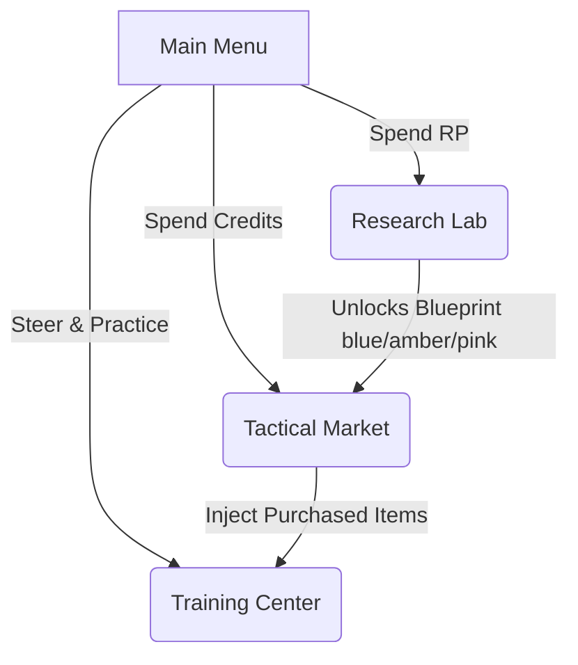

# 🪐 Star Destroyer: Single Shot

[](https://flutter.dev)
[](#)
[](#)

A premium, portrait-optimized cosmic physics puzzle game built with Flutter. Take command of the Empire's ultimate superlaser system to vaporize shielded target planets in a single, consolidated firing sequence. Harness the laws of orbital mechanics, vector reflections, laser splitting, wormholes, and gravitational singularities to establish stellar dominance.

---

## 🚀 Premium Features & Mechanics

### 1. Ergonomic Vertical Gameplay & Portrait Grid
* **Adaptive 8x12 Physics Grid**: Re-engineered from legacy widescreen layouts into a portrait format. Resizes dynamically and responsively across smartphones, tablets, and web viewports.
* **Full-Screen Space Canvas**: The background is expanded to 100% of the viewport. Features custom radial nebulae, sparkling star fields, and twinkling star clusters.
* **Subtle Borderless Grid**: Removed heavy outer borders for a premium floating aesthetic where planets and celestial structures float seamlessly in the vastness of space.

### 2. Immersive Gesture-Driven Firing Dial
* **Swipe-to-Steer Controls**: Wrapped in high-fidelity gesture handlers. Simply swipe horizontally anywhere on the screen to rotate and steer the aiming angle.
* **Auto-Fading Tactical HUD**: The semi-circle aiming dial, degree marks, and angle ticks fade in smoothly during active aiming and fade out completely when idle to prevent visual clutter.
* **Subtle Projector Beam**: A low-opacity aiming preview guide stays visible to help plan coordinates while the active dial is hidden.

### 3. Dynamic Laser Traveling Blaster Bolt
* ** traveling Laser Missile**: Replaced solid vector paths with a discrete traveling blasing energy bolt spanning a short window (2.0 grid units).
* **Smooth glow & Fading Tail**: The blaster bolt features a glowing core and outer neon trail that tapers in thickness and fades in opacity toward the tail.
* **Impact Dissolving Animation**: On impact with target planets or walls, the bolt head stops and the tail continues flying forward into the impact coordinate, contracting and dissolving beautifully.

### 4. Mathematically Precise Mirror Physics
* **Segment Intersection Engine**: Snapping is replaced by a mathematically precise 2D segment-intersection collision solver ($R = I - 2(I \cdot N)N$) using vector cross-products.
* **Narrow-Phase Geometry**: Reflectors behave like actual glass mirrors. The laser reflects off the exact sub-coordinate of surface contact. If the laser misses the mirror segment, it passes cleanly through the cell without phantom collisions.

---

## 🏛️ Tactical Systems & Progression Loops



### 🎛️ Training Center (Campaign Route)
Learn the operational rules of celestial warfare. Work through designed sectors where you must destroy all targets. Features fully responsive vertical layouts and a sliding glassmorphic inventory drawer to place devices.

### 🧪 Research Lab (R&D Console)
Earn **Research Points (RP)** by clearing training missions. Spend RP in the Lab to unlock blueprints for Splitter variants, Portals, and Gravity Wells.

### 🛒 Tactical Market (Storefront storefront)
Spend **Credits** earned in missions to buy extra permanent copies of researched equipment. Features HSL-tailored card animations, credit checkers, ownership counters (`+X OWNED`), and interactive haptic vibration responses.

---

## 🛠️ Tactical Blueprint Modules

| Device | Icon | Cost | Operational Mechanics |
| :--- | :---: | :---: | :--- |
| **Deflector Mirror** | 🎛️ | 150 | Reflects laser beams at standard vector reflection angles. Rotates in $45^\circ$ increments. |
| **Laser Splitter** | 🔀 | 350 | Splits a single incoming beam into two opposite streams (180° splitting variant). |
| **Gravity Well** | 🌀 | 600 | Generates microscopic singularities pulling beams within a 3.5 cell radius. |
| **Warp Portal** | 🕳️ | 800 | Creates linked Einstein-Rosen bridges that teleport beams while preserving angle. |
| **Proximity Bomb** | 💣 | 450 | Volatile core detonating on laser touch, destroying all planets within a **2.2 cell radius**. |

---

## 💻 Tech Stack & Architecture

- **Engine Core**: Flutter (Dart) using high-performance CustomPainters.
- **Physics Solver**: Custom ray-casting vector engine with gravitational vector bending, segment intersection detection, and recursive portal transitions.
- **Routing**: `GameRouter` stateful routing with navigation history tracking (remembers previous screens to dynamically handle back navigation).
- **State Management**: Lightweight change notifier model listeners combined with `ListenableBuilder` widgets.

---

## 🏁 Getting Started

### Prerequisites

- [Flutter SDK](https://flutter.dev/docs/get-started/install) (v3.22+ recommended)
- Dart SDK (v3.4+ recommended)

### Run the App

1. Clone the repository:
   ```bash
   git clone git@github.com:Dmitriy-ateo/VBC_StarDestroyer.git
   cd VBC_StarDestroyer
   ```
2. Install dependencies:
   ```bash
   flutter pub get
   ```
3. Run the development environment:
   ```bash
   flutter run
   ```

### Running Tests
To run unit and widget smoke tests:
```bash
flutter test
```

### Compiling Production Web Build
```bash
flutter build web
```

---

## 📜 Mandatory Level Solvability Protocol
Every level committed to `lib/models/level_data.dart` must be mathematically solvable. Keep placement coordinates free of physical structures (e.g. static asteroid blocks) that obstruct reflection paths. For volatile bomb triggers, ensure target planets lie within the explosion radius:
$$\sqrt{(x_{planet} - x_{bomb})^2 + (y_{planet} - y_{bomb})^2} < 2.2$$

---
*Developed by VibeGaming Studio — Classified Imperial Architecture.*
