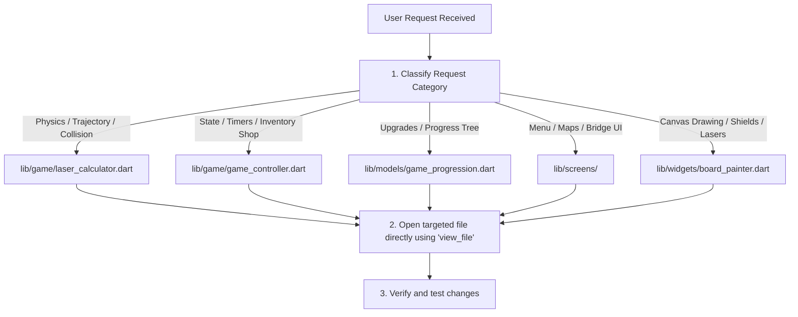

# Source Tree Map & Optimized Agent Search Guide

This file provides an optimized directory mapping and search configuration file for **AI Developer Agents** working on the *Star Destroyer: Single Shot* project.

---

## 1. Project Directory Structure Map

```
├── .dart_tool/                  # [SKIP] Flutter build tools caches
├── .idea/                       # [SKIP] IDE configuration assets
├── android/                     # [SKIP] Native Android packaging layer
├── ios/                         # [SKIP] Native iOS packaging layer
├── macos/                       # [SKIP] Native macOS packaging layer
├── windows/                     # [SKIP] Native Windows packaging layer
├── linux/                       # [SKIP] Native Linux packaging layer
├── web/                         # [SKIP] Native Web deployment modules
├── assets/                      # [Target assets]
│   └── images/
│       └── captain_bridge.png   # The bridge view deck layout mockup
├── lib/                         # [MAIN CODE SEARCH TARGET]
│   ├── main.dart                # Application entry and route manager
│   ├── config/                  # Static campaign JSON configuration matrices
│   ├── game/                    # Stateless physics raytracers & controllers
│   ├── models/                  # RPG progress tree structures & grid states
│   ├── screens/                 # Premium Glassmorphic UI view screens
│   ├── theme/                   # Cyberpunk HSL/Neon palettes StyleGuide
│   └── widgets/                 # Custom Painters & interactive controllers
└── test/                        # [UNIT & WIDGET TESTS TARGET]
    ├── persistence_test.dart    # Progression auto-save persistence tests
    ├── progression_test.dart    # Upgrades mechanics and Daily Hard tests
    └── widget_test.dart         # UI rendering sanity smoke test
```

---

## 2. Core Source Code Catalog (`lib/`)

Use this index to target your file searches immediately based on the category of the feature request:

| Directory | File Path | Major Classes / Methods | Core Technical Role |
| :--- | :--- | :--- | :--- |
| **Config** | `lib/config/campaign_config.dart` | `campaignJsonConfig` | Hardcoded JSON metadata defining campaign galaxies, quest lines, credit rewards, asteroid grids, and wall placements. |
| **Config** | `lib/config/levels_config.dart` | `preloadedLevelsJson` | Hardcoded JSON metadata defining standard campaign levels 1 to 15. |
| **Game Logic** | [game_controller.dart](file:///Users/dmitrijkabakov/Work/ThirdParty/FlutterApp/VibeGaming/DS1/lib/game/game_controller.dart) | `GameController`, `fireLaser()`, `completeSimulation()` | State machine managing placement lists, active angles, shop upgrades, rollover triggers, and local saving/loading. |
| **Game Logic** | [laser_calculator.dart](file:///Users/dmitrijkabakov/Work/ThirdParty/FlutterApp/VibeGaming/DS1/lib/game/laser_calculator.dart) | `LaserCalculator`, `traceLaser()` | Pure, stateless vector physics engine tracing coordinates and computing reflection, split refraction, portals, and curved gravitational slingshots. |
| **Game Logic** | [sector_generator.dart](file:///Users/dmitrijkabakov/Work/ThirdParty/FlutterApp/VibeGaming/DS1/lib/game/sector_generator.dart) | `SectorGenerator`, `generateDailySector()` | Procedural generator crafting daily quests and high-difficulty daily hard threat scenarios deterministically. |
| **Models** | [device_model.dart](file:///Users/dmitrijkabakov/Work/ThirdParty/FlutterApp/VibeGaming/DS1/lib/models/device_model.dart) | `DeviceModel`, `DeviceType` | Data model defining mirrors, splitters, portal pairs, gravity wells, and bombs. |
| **Models** | [level_data.dart](file:///Users/dmitrijkabakov/Work/ThirdParty/FlutterApp/VibeGaming/DS1/lib/models/level_data.dart) | `LevelData`, `PlanetTarget`, `WallBlock` | Data model mapping sector grids, destructible obstacles, energy shields, and coordinates. |
| **Models** | [game_progression.dart](file:///Users/dmitrijkabakov/Work/ThirdParty/FlutterApp/VibeGaming/DS1/lib/models/game_progression.dart) | `GameProgression`, `toJson()`, `fromJson()` | Serialized model managing accumulated credits, RP, unlocked blueprints, chassis RPG progression, and daily rollover checks. |
| **Screens** | [command_bridge_screen.dart](file:///Users/dmitrijkabakov/Work/ThirdParty/FlutterApp/VibeGaming/DS1/lib/screens/command_bridge_screen.dart) | `CommandBridgeScreen` | Fully screen-spanning Captain's Deck tactical navigator utilizing Relative Hotspot coordinates and vector micro-animations. |
| **Screens** | [galaxies_map_screen.dart](file:///Users/dmitrijkabakov/Work/ThirdParty/FlutterApp/VibeGaming/DS1/lib/screens/galaxies_map_screen.dart) | `GalaxiesMapScreen` | Interactive galaxy sector select screen featuring offline calendar threat rollover checks and lock/unlock indicators. |
| **Screens** | [galaxy_board_screen.dart](file:///Users/dmitrijkabakov/Work/ThirdParty/FlutterApp/VibeGaming/DS1/lib/screens/galaxy_board_screen.dart) | `GalaxyBoardScreen` | Radial node campaign dashboard showing quest logs, loadouts, and deployment consoles. |
| **Screens** | [game_board_screen.dart](file:///Users/dmitrijkabakov/Work/ThirdParty/FlutterApp/VibeGaming/DS1/lib/screens/game_board_screen.dart) | `GameBoardScreen` | Core interactive tactical interface managing mirror placement and superlaser steering controls. |
| **Screens** | [research_shop_screen.dart](file:///Users/dmitrijkabakov/Work/ThirdParty/FlutterApp/VibeGaming/DS1/lib/screens/research_shop_screen.dart) | `ResearchShopScreen` | RPG Armory interface handling top-aligned floating snackbar upgrades and blueprint unlocks. |
| **Screens** | [market_screen.dart](file:///Users/dmitrijkabakov/Work/ThirdParty/FlutterApp/VibeGaming/DS1/lib/screens/market_screen.dart) | `MarketScreen` | Storefront interface managing device count purchases. |
| **Theme** | `lib/theme/style_guide.dart` | `StyleGuide` | Design tokens for cyberpunk neons, blurred container styling, and fonts. |
| **Widgets** | [board_painter.dart](file:///Users/dmitrijkabakov/Work/ThirdParty/FlutterApp/VibeGaming/DS1/lib/widgets/board_painter.dart) | `BoardPainter` | Pure canvas rendering engine painting engines, laser vectors, space portals, gravity wells, engines fire, and shield rings. |

---

## 3. Optimized Search Exclusions for Ripgrep / Grep Search

When searching files, **DO NOT** execute recursive global directory searches. This consumes massive context space and produces noisy results from compiled logs, builds, and platform code.

### Ripgrep (grep_search) Glob Filters
- **Target Directories**: `lib/`, `test/`
- **Skip Patterns**: Add the following search exclusions to your query configurations:
  ```json
  "Includes": ["lib/**/*.dart", "test/**/*.dart", "pubspec.yaml"]
  ```

---

## 4. Search Protocol for AI Developer Agents

When asked to implement a new feature or debug an issue, follow this systematic workflow:



### Execution Directives
- **Direct Reads**: Instead of performing a broad search with `grep_search` on the entire workspace, lookup the file path from the catalog table above and use `view_file` directly with line numbers to save tool calls and context size.
- **Strict Isolates**: For calculations/physics changes, isolate variables in `laser_calculator.dart` without linking UI classes.
